# ArcGIS Pro 101


Stacey Maples – Geospatial Manager – Stanford Geospatial Center – stacemaples@stanford.edu

David Medeiros – GIS Instruction & Support Specialist - Stanford Geospatial Center - davidmed@stanford.edu

## Overview

This workshop aims to accomplish two things: Introduce participants to basic vocabulary, concepts and techniques for working with spatial data in research and introduce the interface and tools in ArcGIS Pro, a desktop GIS software distributed by Esri. This introductory session will focus upon the fundamental concepts and skills needed to begin using Geographic Information Systems software for the exploration and analysis of spatial data using the QGIS platform.  

Topics will include:  

* What is GIS?
* Spatial Data Models and Formats
* Projections and Coordinate Systems
* Basic Data Management
* The ArcGIS Pro User Interface
* Simple Analysis using Visualization

GIS Resources:
Stanford Geospatial Center website - http://gis.stanford.edu/

Stanford GIS Listserv - https://mailman.stanford.edu/mailman/listinfo/stanfordgis


Download Tutorial Data

## Setup

Users should prepare for this workshop by installing the ArcGIS Pro software and downloading the data to their local hard drive.

Stanford Geospatial Center's ArcGIS Pro Installation files can be obtained by Stanford Affiliates with a valid SUNetID at: [https://stanford.box.com/v/EsriSoftwareInstallers](https://stanford.box.com/v/EsriSoftwareInstallers) 

### Software

This workshop was created using ArcGIS Pro version 2.4.x. If you are installing for the first time, using the above referenced installer, be sure to log into your Stanford ArcGIS.com account to enable updating of the software to the most recent version.

[https://qgis.org/en/site/forusers/download.html](https://qgis.org/en/site/forusers/download.html)

### Data

The data package for the workshop can be downloaded from [https://github.com/mapninja/QGIS-101/archive/master.zip](https://github.com/mapninja/QGIS-101/archive/master.zip)

The project data folder contains the following datasets:

* **deathAddresses.csv**  - this is a table latitude and longitude coordinates for addresses affected by the cholera outbreak. This table also contains the number of deaths at each address.  
* **snow_map.png.tif** - this is a non-georeferenced image of the map from John Snow's original report on the cholera outbreak of 1854. 
* **Study_Area.shp** - This file is simply a rectangular feature that describes our area of interest.  


#### Additional Files
There is an extra backup data folder that contains versions of files that we will create during the workshop. These files are provided in case any of the steps can't be completed due to software errors or other problems. Welcome to working with open source.  
* **Snow-cholera-map-1_modified** - this is a geo-referenced image of the map from John Snow's original report on the cholera outbreak of 1854.  
* **Water_Pumps.geojson** - this is a spatial data file containing the locations of all of the water pumps recorded in John Snow's original map of the cholera outbreak.  Who woo hoo 

## Getting started on a project  

In this section we will cover starting a new QGIS project. We will create a new map document, go over the basic QGIS interface, customize that interface, add a plug-in and bring a base map into your QGIS project.

### Create a Map Document

1. To create a new map document, Open ArcGIS Pro...
2. On the resulting splash page, select "Start without a template." You will be presented with a blank ArcGIS Pro interface. 
3. Switch to the **Insert** Tab at the top of ArcGIS Pro, if necessary. Click on the **New Map** button to add a basemap and create a view similar to that, below:

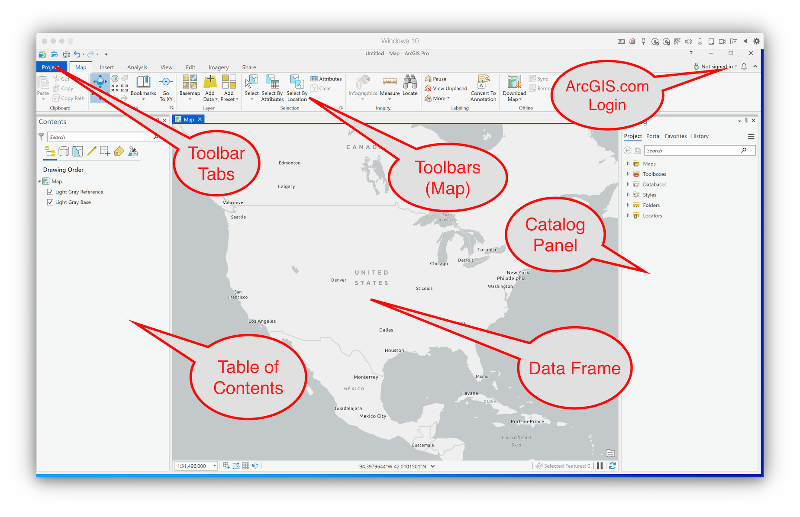

### Interface overview

The ArcGIS Pro interface is similar to many Windows-based desktop applications and the basic ArcGIS Pro layout resembles most others GIS interfaces in that it uses a table of contents and data frame model for user interaction. 

#### The Basic Components of the ArcGIS Pro Interface

The ArcGIS Pro interface is made up of three basic components:

**The Data/Map Frame** – the map canvas is where your visualizations of data will show up when you had a new data layer. This is where you will view the changes that are made when you adjust symbology, when you change the order of layers, or when you produce a new data set through geo-processing  

**The Table of Contents** - The Table of Contents, like that in ArcMap, is where the "Layers" and datasets appear, as they are added to the map. Accos teh top of the Table of Contents, you are able to change the view from "Display order" to 


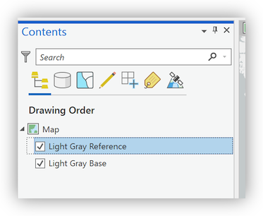

**Ribbon** - ArcGIS Pro uses a ribbon toolbar at the top of the interface which organizes tools into related themes, such as Map and Analysis. Other themes will appear when their context is enabled. For instance, clicking on one of the basemap layers enables the **Vector Tile Layer Appearance** tab, which provides for setting scale-dependent rendering and transparency.

  

### Add an existing data layer
Now we're going to add an existing data layer. The data layer that we will add describes our **Area Of Interest** in this study. This layer will provide us with a convenient way to orient our data frame to the area that we are interested in, as well as providing a way to limit the processing extent of certain geo-processing tools.

1. In the **Catalog panel**, right-click on the **Folders** item and click on "Add folder connection."  Browse to the data folder for this workshop, select and clikc **Add**
2. Expand the newly added data folder, and drag-and-drop the Study_Area.shp file into your **Map** frame.
3. Right click on the **color patch** for the newly added layer, in the Table of Contents and select **No color**


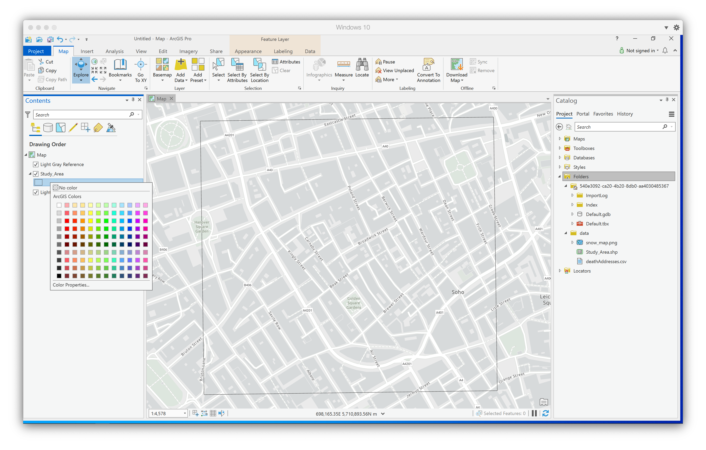

### Save the project


### Create a data layer from an XY table?

Often the data sets that you want to work with will not come as spatial data sets. In this step we will add a table of data that contains fields with the latitude and longitude coordinates of the deaths addresses we want to analyze.

1. Return to the Catalog Panel and, in the data folder, right-click on the deathAddresses.csv and select Export>Table to Point Feature Class. This will open the **XY Table to Point** Geoprocessing Tool as a tab on top of the Catalog Panel.
2. For **Output Feature Class**, check that the feature class will be exported to the default.gdb in your project folder and replace the default name with "**Deaths**"
3. The remaining settings should be as shown below:  
  
4. Click **Run** and wait for the points to be added to the Map panel.

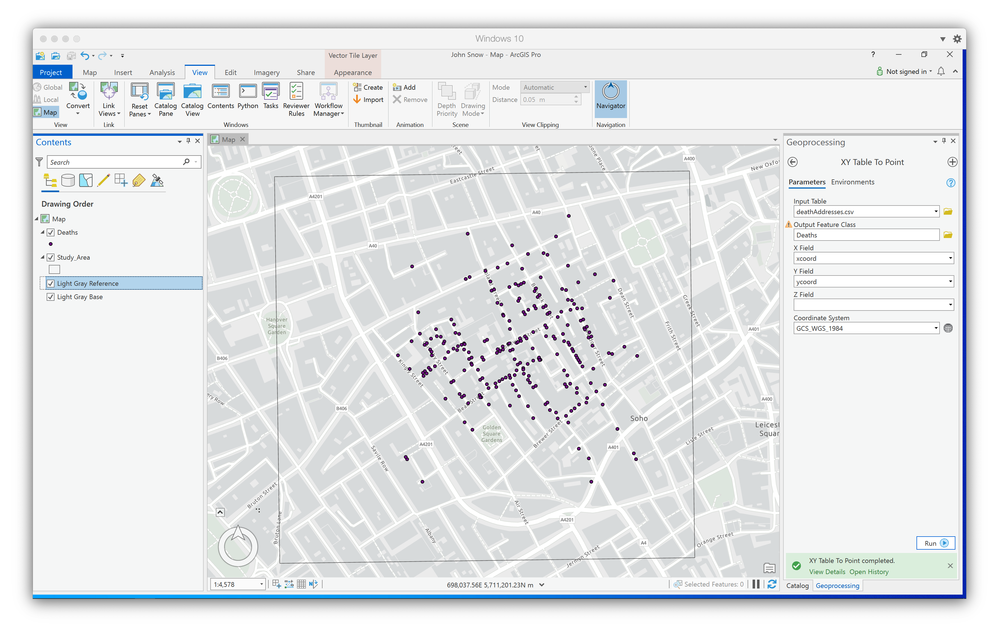

### Layer symbology  
#### Proportional symbols on Deaths  

1. Right-click on the Deaths layer, in the Table of Contents, and select Symbology... to open the Symbology Panel tab on top of the Catalog and Geoprocessing Panels that are already opened.
2. Use the Drop-down to change the Primary Symbology to **Proportional Symbols** and set the Field=Num_Cases
3. Note in the **Histogram** and the bottom of the panel that the range of values for the Num_Cases is 1-8. Set the Minimum size = 1.00 and the Maximum size = 18, accordingly.
4. Click on the Template for the symbol and select Circle 3 (40%). Return to the Symbology panel by clicking on the back arrow at the top of the panel.  

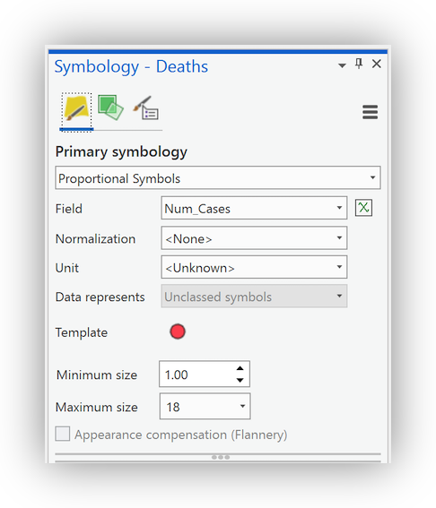

#### Bonus: Setting a Reference Scale

1. Now that you have created a symbology, zoom in and out of the daMap/Data Frame to see how the symbology interacts with the scale of the map. Note that the symbology remains the same size, regardless of the scale that you are viewing the map. 
2. Right-click on the **Map** item at the top of the **Table of Contents** and select **Properties**, to open the **Map Properties** dialog.
3. In the **General** table, change the **Reference scale** option to 1:5000. Click OK to apply the setting.
4. Zoom in and out of the Map to see that the symbols now change size with the scale of the map. 

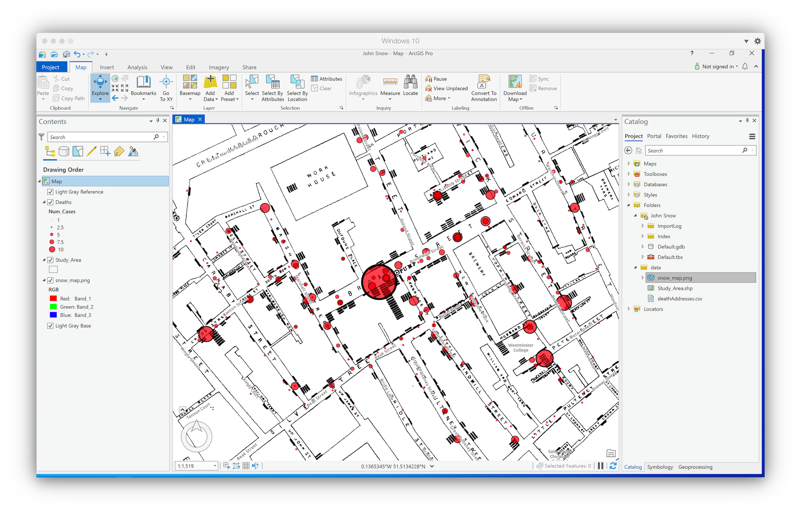

### Explore Map tools

Now we will explore the **Map tools** in ArcGIS Pro. 

The **Map/Navigate Toolbar** provides the bulk of the tools for navigation in
the **Map Frame**. Navigation in the ArcGIS Pro Map is accomplished using the mouse to click-&-drag, and the scrolling wheel to zoom in and out, similar to web "slippy" maps. 

 


* The **Zoom Tools** allow you to:  
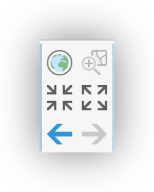 
	* Zoom to Full Extent 
	* Zoom to Selection 
	* Fixed Zoom In & Out 
	* Next & Previous Extent


### Spatial Bookmarks

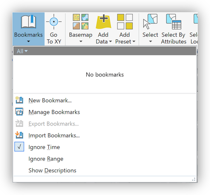 

Often, we want to be able to move around in our data frame examining different parts of the map zooming in and out, and then returning to our primary area of interest. This can be easily accommodated through the use of spatial bookmarks. Here you'll create a spatial bookmark which allows us to quickly return to the area that we are interested in.

1. Previously we used the main menu to enable a panel. This time, try right-clicking in any empty area of the toolbar then scroll down and select the **Spatial Bookmarks panel** from the menu that is presented.
2. Right-click on your study_area layer and select **Zoom to layer**.
3. Click on the **Add Bookmark** button and rename the resulting Spatial Bookmark: "**SOHO**"  

4. Click on the **Zoom Full** button to zoom to the world, then use the **Zoom to bookmark ** button to return to your Area of Interest.

### The Layers Tools

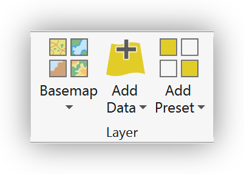  

The **Layer tools** provide the ability to Add or change the basemap for the Map Frame, as well as adding existing data from a number of sources (File, Web Services, etc...). 
### The Selection Tools

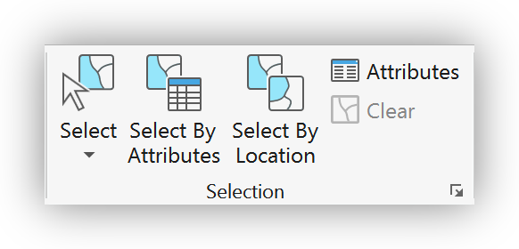  

The **Selection tools** Provide ways to select features within a layer interactively, by intersection with other layers, as well as by Attributes. 

## Working with spatial data
### Viewing the Attribute Table

Up to this point we've been mostly concerned with building a new map project. Now we'd like to take a peek at some of the data behind the Map Frame.

1. Right-click on the **Deaths** layer in the **Table of Contents** and select **Attribute Table**.
2. Note that you can sort fields, scroll, select by attributes, etc...

### Statistics on a field  

As mentioned, above, the **Num_Cases** field in the Deaths layer indicates the number of deaths at each address in the dataset. You can get a simple statistical snapshot of the variable from the Attribute Table.

1. Right-click on the header of the **Num_Cases** field and select **Statistics**
2. A histogram of the data distribution will appear over the top of the Attribute Table, and a "Distribution of Num_Cases" panel will appear in the tabbed panel area, on the right. 
3. On the window select **Death Addresses** as the Input Vector layer and **Num_Cases** as the Target field.
4. **Click Run** and **Close** 
5. Look for the **Results Viewer** panel which should have been activated, and click on the **Hyperlink** to open the summary in a web browser.  


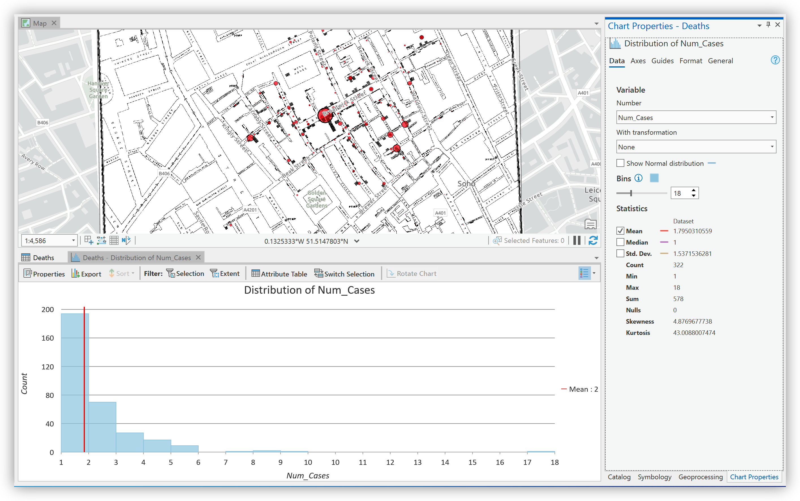   

## Creating Spatial Data

### Georeference a map  

Our goal in this workshop is to explore the cholera outbreak of 1854 and determine whether there is evidence that the Broad Street pump is the source of the outbreak. To do this we want to spatially allocate all of the death addresses in our data set to the water pump that they are nearest. Often the data that we need for our analysis doesn't exist in the format that we need it in. In this section we will use John Snow's original map of the 1854 cholera outbreak as a source for the locations of the water pumps in our analysis. 

1. Browse to the data folder and drag-and-drop the **snow_map.png** image into the Map of your project. 
2. Click Yes when prompted to "Build pyramids..."

3. Note that the layer is added to the Table of Contents, but doesn't' not yet appear in the Map Data Frame.
4. Click on the **snow_map.png** Layer to select it and then click on the Imagery tab to activate the Imagery tools. Click on the Georeference Tool to open the Georeferencing Tools and start georeferencing.  
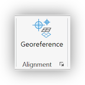
5. Right-click and "Zoom to..." the **snow_map.png**, then use the mouse scroll button to zoom to the upper left corner of the image, where the **Regent Circus** can be found.
6. Click on the **Add Control Points** tool and then place a Control Point Link at the center of Regent Circus.

7. Right-click and "Zoom to..." the **Study_Area** layer. Use the mouse scroll wheel to zoom into the same area of Regent Circus, and place the second GCP link at that location. Note that the map image will automatically "snap" these two GCP links together.  

8. Use the scroll wheel to zoom out and then into the bottom right corner of the **snow_map.png** layer to find the Intersection of **Oxendon Street & Coventry Street**. Add a Ground Control Point link to the Southeast corner of the intersection.
9. Toggle off the visibility of the **snow_map.png** and **right-click>Zoom to...** the **Study_Area** layer. 
10. Locate the corresponding intersection in the now visible basemap and place the second link of the Control Point. 
11. Toggle the visibility of the **snow_map.png** layer to see that it has "snapped" these two links together, as before. 
12. Locate and place 3 more **Ground Control Points** (1 in each remaining corner and one near the center).  
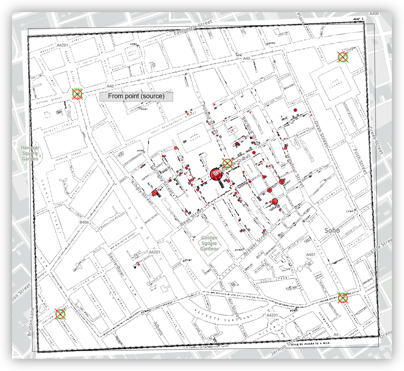
13. Click on the **Export Control Points** button and save the control points you have created to your data folder as GCP.TXT.
14. Click on the **Save** button of the **Georeference** toolbar, then click on the **Close Georeference** button. 
15. Browse to the **data** folder using your Windows File Explorer and note that new files have been added to the folder. They include **snow_map.png.pgwx**, which is the "World File" for the image you just georeferenced. As long as this file sits next to the **snow_map.png** file, GIS applications, such as Google Earth Desktop, ArcGIS, QGIS, etc... should now be able to colocate this image with other datasets.  

 
### Digitize features from a georeferenced map

If the last section didn't go well, add the ```John_Snow_Map.tif``` from the **/backup_data/**  

Now we would like to digitize the locations of the **Water Pumps** in the neighborhood, from the **john_snow.png**. To do this, we first need to create and  "empty" Feature Layer in our default.gdb for the project we are working on. 

1. Return to the Catalog panel and browse to **Databases**, right-click on the **Default.gdb** and go to **New>Feature Class** to begin the New Feature Class dialog.  
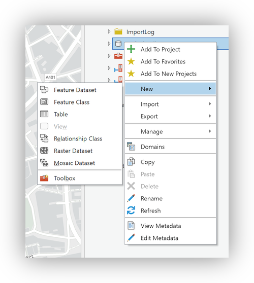  
2. In the resulting dialog, use these settings: **Name:** pumps; **Alias:** Water Pumps; **Feature Class Type:** Point. Click **Next**.  
  
3. Add a Field: **Field Name:** Label; **Data Type:** Text. Click **Next**.  
  
4. Set the **Spatial Reference** to **GCS WGS 1984**. Click **Finish**. 
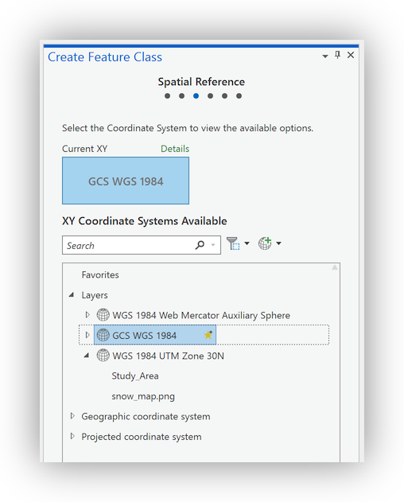   


### Add points to your Feature Class

1. Drag-and-Drop the new **pumps** Feature Class into your Map Frame. Note that the layer is added to the Table of Contents, using the alias: **Water Pumps**. 
2. With the **Water Pumps** layer selected in the Table of Contents, Click on the Edit Tab, at the top of ArcGIS Pro, to activate the Edit tools.   
  
3. Right-click on the **Water Pumps** layer and Open the **Attribute Table**. If it is not, already, drag the attribute table to dock it at the bottom of the Map Frame.
3. Click on the **Create** tool button, and note that a set of templates for each of your vector data layers will appear in as a panel on the right.  
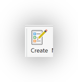  
4. Click on the **Water Pumps** template, in the **Create Features** panel on the right, to select the Water Pump point.  
5. Locate a Water Pump in the **snow_map.png** layer and click on it to place the point. 
6. In the Attribute Table, below, double-click on the new record, under the **Label** field and enter a value for the Label field (we will use the name of the nearest street), and hit **RETURN**.
7. Repeat for the remaining 12 water pumps in the Snow Map.  
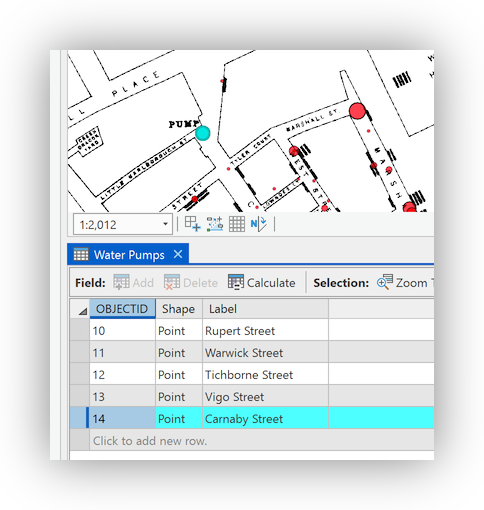  
8. Click the **Save** button and confirm to save your edits.
9. Close the **Create Features** Panel to close the edit session.
10. Close the Water Pumps Attribute Table.
11. Zoom to the Water Pumps.
12. Toggle off the visibility of the **snow_map.png** layer.  
  


### Bonus: Finding an already georeferenced map from DavidRumsey.com

There are many venues for searching for old maps as sources for spatial data and I've listed a few of our favorites, below. Of course, there are many considerations of scale, authority, projections, etc... when using a scanned map as a data source, it is possible to scan and georeference just about any map you can find reference data (another map to georeference to) for.

* [earthworks.stanford.edu](earthworks.stanford.edu)
* [DavidRumsey.com](DavidRumsey.com)
* [OldMapsOnline.com](OldMapsOnline.com)

We'll start by looking at this map [[Gegend von London 1853](https://www.davidrumsey.com/luna/servlet/detail/RUMSEY~8~1~298861~90066747:Gegend-von-London-1853?sort=Pub_List_No_InitialSort%2CPub_Date%2CPub_List_No%2CSeries_No&qvq=w4s:/where%2FLondon%2B%252528England%252529%2Fwhen%2F1854;q:london%201854;sort:Pub_List_No_InitialSort%2CPub_Date%2CPub_List_No%2CSeries_No;lc:RUMSEY~8~1&mi=1&trs=2)] of London on [https://davidrumsey.com](https://davidrumsey.com). It already has a "**Georeferenced** version, which can be viewed by clicking on the **Georeferencer** button at the top of the page.


David Rumsey makes Open Geospatial Consortium (OGC) compliant services available for  georeferenced maps on his site. This means that you can use the maps directly in most modern GIS applications, including ArcGIS Pro, QGIS, ArcGIS Online, etc...

### Adding a DavidRumsey.com WMTS map Service to ArcGIS Pro

Here is the **Web Map Tile Service WMTS URL** for the Gegend map:  

```http
https://maps.georeferencer.com/georeferences/28da2318-c4b3-5f25-83dc-3da27859fea2/2019-02-19T17:27:12.514288Z/wmts?key=mpIMvCWIYHCcIzNaqUSo&SERVICE=WMTS&REQUEST=GetCapabilities
```
 
This URL provides access to the georeferenced map outside of the DavidRumsey.com website.

## Basic spatial data analysis (Using Geoprocessing Tools in ArcGIS Pro)

### Voronoi (Thiessen) polygon (Spatial Allocation)

Thiessen polygons allocate space in an area of interest to a single feature per polygon. That is, within a Thiessen polygon, all other features are closer to the point that was used to generate that polygon than to any other point in the feature set. In this case, we will create a set of Thiessen polygons based upon the locations of the Water Pumps in our project. This will allow us to easily allocate all of the points in our death addresses dataset to the water pump that they are nearest using a simple spatial join.

1. At the top of **ArcGIS Pro**, click on the **Analysis tab**, then click on the **Tools button**, which will open the **Geoprocessing** panel at the right. 
2. Using the **Find Tools** box, Search for **Voronoi** and click on the **Create Thiessen Polygons** tool, in the results.
4. Set the options as: **Input Features:** Water Pumps; **Output Feature Class:** Voronoi: **Output Fields:** All fields.  
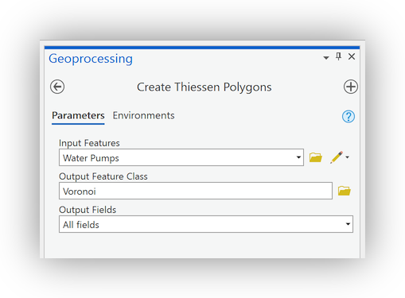  
5. Click on the **Environments** tab and set the **Extent:** **Same as:Study_Area**; and click **Run**.  
6. The result will be (as shown below) a layer of polygons that define the area closest to the water pumps that generated them.   
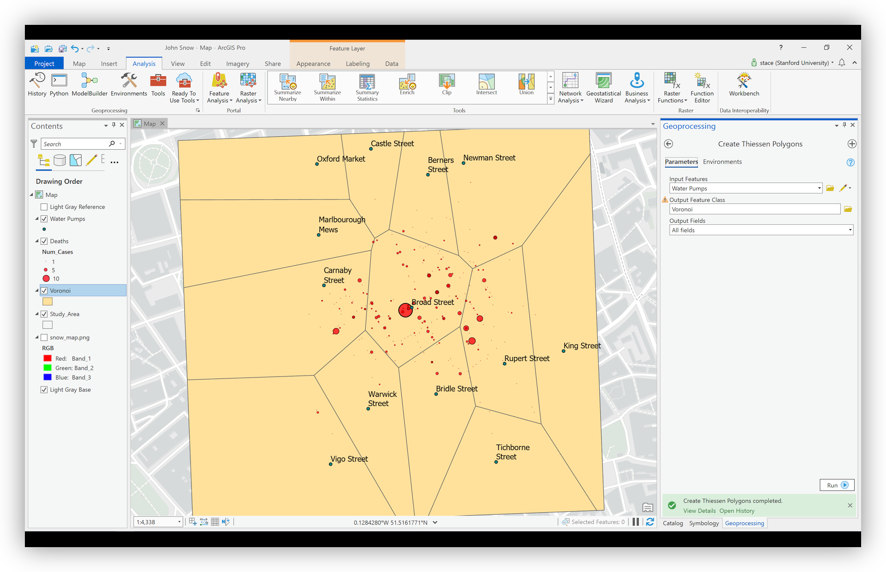  
7. Right-click on the new Voronoi layer and Open the Attribute table. Note that it contains the fields from the **Water Pumps**, including the **Label** field.  

### Spatial Join (Point Aggregation)

Now that you have created the Voronoi polygon layer, you will “allocate” each of the deaths to one of the Voronoi polygons. To do this, we will use a **Spatial Join**. Conceptually, what we will be doing is like passing our points through the polygons so that the polygon's attributes "stick" to the points.  


1. Right-click on the Deaths layer and go to **Joins and Relates>Spatial Join** to open the **Spatial Join** Geoprocessing tool.
2. Because the tool was opened from the **Deaths** layer, the **Target Features:** are correctly set. Use the drop-down to select **Voronoi** as the **Join Features** and change the **Output Feature Class** to **Deaths_Allocated**. The remaining default settings should appropriate.  
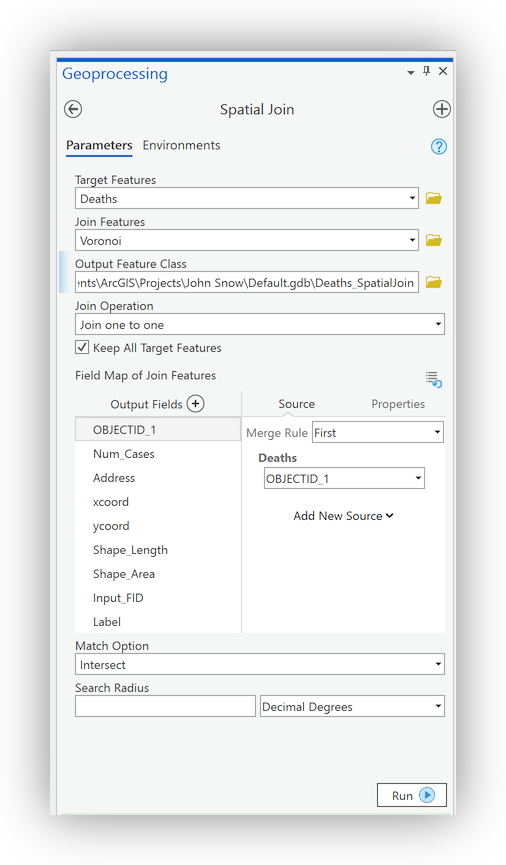  
3. A new layer, called **Deaths_Allocated** will be added to the **Table of Contents**. Right-click on the new **Deaths_Allocated** layer and open the **Attribute Table** to confirm that each record now has the "**Label**" for the the nearest **Water Pump**.   
  

### Summary Statistics

Finally, we would like to summarize the deaths in the outbreak, grouping our summary by the name of the Water Pump that each Death Address is nearest. We will do this using the **Summary Statistics Tool** which allows us to do a statistical summary similar to the one we did earlier on the entire data set, but this time grouped by nearest water pump.

1. With the **Deaths_Allocated Attribute Table** still open, right-click on the header for the **Num_Cases** column and select **Summarize** to open the **Summary Statistics** Geoprocessing tool.
2. Use the drop-downs to set the Statistics Fields as shown, below:  
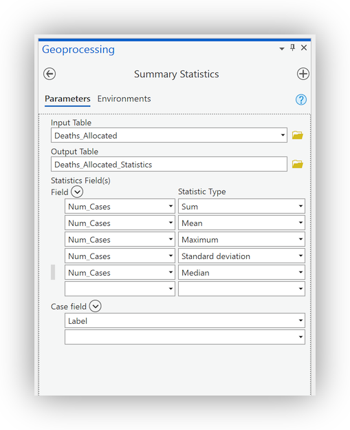  
3. Set the **Case field** to the **Label** column, in order to group the summary by nearest **Water Pump**


## Basic Measures of Spatial Central Tendency

### Spatial Mean (Mean Center)

The Mean Center is the average x- and y-coordinate of all the features in the study area. It's useful for tracking changes in the distribution or for comparing the distributions of different types of features. Here, we will use the Mean Center to highlight the distribution of deaths around the Broad Street Pump.  

First, we will calculate a simple spatial mean. This is simply the mean center of the **distribution of locations** 

1. On the pull-down menu go to menu go to **Vector \> Analysis \> Mean
coordinate(s)**  
  

1. Select **Deaths_Allocated** as the Input vector layer.
2. Leave the **Weight field** and **Unique ID field** as **Optional.**
3. **Click Browse** to **save** the Output Shapefile as:
    **Deaths\_Spatial\_Mean** to the **Data** Folder**.**
4. **Click OK** to calculate the **Mean Center** and **Close**.
5. Change the **Symbology** for the **Deaths\_Spatial\_Mean layer** to something that contrasts with the other symbologies.

### Weighted Spatial Mean

1. **Run** the **Mean Center tool** again, this time assigning the
   **Num_Cases** field as the **Weight Field**.
2. **Save** the **Output Shapefile** to the **Data** folder and name it **Deaths_Weighted_Spatial_Mean**.
3. **Apply a symbology** to the **Deaths_Weighted_Spatial_Mean layer**.

#### Bonus:  
Set the "Unique ID" option to the "label" field and observe the results. This has the effect of "casing" the spatial mean, based upon the spatial allocation that we did earlier.

### Standard Distance

The Standrad Distance is the spatial statistics equivalent of the standard deviation. It describes the radius around the spatial mean (or weighted spatial mean), which contains 68% of locations in your dataset. It can be very useful for working with GPS data.


On the pull-down menu go to menu go to **Processing \> Toolbox** to open the
**Processing Toolbox Window.**


On the **Processing Toolbox Window type** to **search**: **Spatial point pattern
analysis** and **double click** to open the tool window.

1.  Select **Death Addresses** as the **Point** layer.

2.  Click the 3 dots and **Select** Save to a file.

3.  **Give** an appropriate name and **Save** the **3 Output Files** on your
    **Data** folder.


**Click Run** to calculate the **Standard Distance, Mean Centre and Bounding
Box.**

>   The red dot is the mean center (no weight field; the large circle is the
>   standard distance, which gives an indication of how closely the points are
>   distributed around the mean center; and the rectangle is the bounding box,
>   describing the smallest possible rectangle which will still enclose all the
>   points.

### Creating a surface from Point Data to Highlight “Hotspots”


#### Kernel Density

The Kernel Density Tool calculates a magnitude per unit area from the point features using a kernel function to fit a smoothly tapered surface to each point. The result is a raster dataset which can reveal “hotspots” in the array of point data.

1.  Go to the **Processing Toolbox Window** and **type** to search **Kernel Density Estimation (SAGA)** and **double click** to open the tool window.
2.  **Select** the **Deaths_Allocated** layer as the **Points** features.
3.  Select **Num_Cases** as the **Weight Field.**
4.  Set the **Radius** option to **50** (this is in meters).
5.  On the **Output Extent** option, click the 3 dots and select **Use
    layer/canvas extent.**
6.  On the resulting window search for **Study Area** and **Click OK.**


Set the **Cellsize** to 10 (this is also in meters)

1.  On the **Kernel Option click** the 3 dots and select **Save to File.**

2.  **Save** the **Output Raster** to the **Data Folder** as **Kernel_Density.**

3.  **Click Run** to run the Kernel Density tool.

4.  **Right Click** the **Kernel_Density layer** and **open** its
    **properties**.


**Go** to the **Style Tab** and select

1.  **Render Type:** Singleband gray

    1.  **Color Gradient:** White to black

    2.  **Contrast enhancement:** Stretch to MinMax.

    3.  **Load min/max values:** Select min/max and click load.

    4.  **Hue:** Check Colorize and select a color of your choice

    5.  **Resampling:** Zoomed in **Bilinear.**

    6.  **Click OK**


## Creating a Basic Map Layout (in process)

Toggle off uneeded layers & Arrange layers in order of visibility

Change Project CRS to Basemap CRS

Make Symbology & Label adjustments

Rename Layers

Switch to Layout Mode

Add Map

Add Legend

Add Scale

Add Neatline

Add Text

Print to PNG


